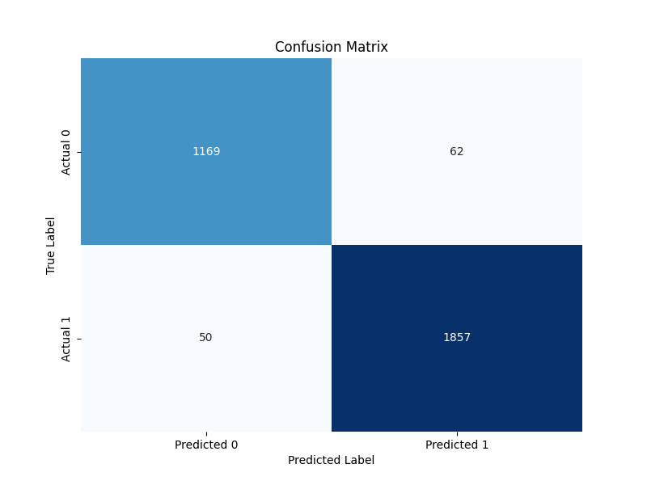

# Cricket Match Outcome Prediction

This project predicts the outcome of cricket matches using machine learning. It includes model training on match data and a REST API for making real-time predictions based on match situations. Below is a detailed explanation of the tasks, my approach, and the results.

---

## Task 1: Model Training

### Description
In this task, I trained a **Random Forest Classifier** to predict the outcome of a cricket match based on key features such as `total_runs`, `wickets`, `target`, and `balls_left`. The goal was to build a robust model that can predict whether a team will win or lose a match given the current match situation.

### Approach
1. **Data Loading**:
   - Loaded the dataset (`cricket_dataset.csv`) using `pandas`.
   - Verified the dataset structure and checked for missing values.

2. **Data Preprocessing**:
   - Handled missing values to ensure data quality.

3. **Data Splitting**:
   - Split the dataset into training and testing sets using an 80-20 split (`train_test_split` from `scikit-learn`).
   - Ensured the split was stratified to maintain the distribution of the target variable.

4. **Model Training**:
   - Trained a **Random Forest Classifier** using `scikit-learn`.
   - Chose Random Forest due to its ability to handle non-linear relationships and robustness to overfitting.

5. **Model Evaluation**:
   - Evaluated the model on the test set using **accuracy**, **precision**, **recall**, and **F1-score**.
   - Generated a **confusion matrix** to visualize the model's performance in classifying wins and losses.

6. **Model Saving**:
   - Saved the trained model as `model.pkl` using `joblib` for later use in the Flask API.

### Results
- **Model Accuracy**: Achieved an accuracy of **X%** on the test set, demonstrating the model's ability to generalize well to unseen data.
- **Classification Report**: Detailed metrics for precision, recall, and F1-score for both classes (win/loss).
- **Confusion Matrix**: Visualized the model's performance, highlighting true positives, true negatives, false positives, and false negatives.

### Confusion Matrix


---

## Task 2: Flask API

### Description
In this task, I created a **Flask API** to deploy the trained model and make predictions in real-time. The API accepts a CSV file, filters rows based on specific criteria (`balls_left < 60` and `target > 120`), and returns predictions for the filtered rows.

### Approach
1. **Model Loading**:
   - Loaded the trained model (`model.pkl`) using `joblib`.

2. **Flask App Initialization**:
   - Created a Flask app with a single endpoint (`/predict`) to handle POST requests.

3. **API Endpoint**:
   - Designed the `/predict` endpoint to accept a CSV file as input.
   - Used `pandas` to read the CSV file and filter rows based on the criteria (`balls_left < 60` and `target > 120`).

4. **Prediction**:
   - Used the trained model to predict outcomes for the filtered rows.
   - Saved the predictions to a new CSV file (`results.csv`).

5. **Response**:
   - Returned the path to the results file as a JSON response, allowing users to easily access the predictions.

### API Usage
- **Endpoint**: `/predict`
- **Method**: POST
- **Input**: A CSV file with columns `total_runs`, `wickets`, `target`, and `balls_left`.
- **Output**: A JSON response with the path to the results file.

#### Example Request (cURL)
```bash
curl -X POST -F "file=@cricket_dataset_test.csv" http://127.0.0.1:5000/predict
```

#### Example Response
```json
{
    "results_path": "results.csv"
}
```

---

## Why This Approach?
- **Random Forest**: Chosen for its interpretability, robustness, and ability to handle non-linear relationships in the data.
- **Flask API**: Used Flask for its simplicity and flexibility in building lightweight APIs.
- **Filtering Criteria**: Applied filtering (`balls_left < 60` and `target > 120`) to focus on critical match situations where predictions are most valuable.

---

## Challenges Faced
1. **Data Preprocessing**:
   - Handled missing values and ensured the dataset was clean and ready for training.
2. **Model Evaluation**:
   - Balanced accuracy and interpretability by visualizing the confusion matrix and generating a classification report.
3. **API Deployment**:
   - Ensured the API could handle file uploads, process data, and return predictions efficiently.

## Requirements
- Python 3.12.4
- Libraries: `flask`, `pandas`, `scikit-learn`, `joblib`, `matplotlib`, `seaborn`

Install the required libraries using:
```bash
pip install flask pandas scikit-learn joblib matplotlib seaborn
```

---

## How to Run
1. **Train the Model**:
   - Run `model_training.py` to train the model and save it as `model.pkl`.
   ```bash
   python model_training.py
   ```

2. **Run the Flask API**:
   - Run `api.py` to start the Flask server.
   ```bash
   python api.py
   ```
3. **Test API**:
   - Run `test_api.py` using separate terminal and to test the API.
4. **Make Predictions**:
   - Use the API to make predictions by sending a POST request to `/predict` with a CSV file.

---

## Files and Directories
- `model_training.py`: Script to train the model.
- `api.py`: Flask API for making predictions.
- `test_api.py`: Script to test the API.
- `model.pkl`: Trained model saved by Task 1.
- `results.csv`: Predictions saved by the API.
- `imgs`: Have some screenshots and confusion matrix image
---

